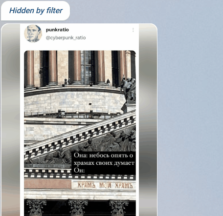

## Telegram Ad Filter

UserScript for [Telegram WebK](https://web.telegram.org/k/) that minimizes messages containing words from the [ad-word list](https://github.com/VChet/telegram-ad-filter/blob/master/blacklist.json).

## Preview

## Installation

1. Install [Violentmonkey](https://violentmonkey.github.io/get-it/)
1. Install the script

   - [from GitHub](https://github.com/VChet/telegram-ad-filter/raw/master/tg-ad-filter.user.js)
   - [from OpenUserJS](https://openuserjs.org/scripts/VChet/Telegram_Ad_Filter)
   - [from Greasy Fork](https://greasyfork.org/en/scripts/379355)

## Contribute

If you have any ideas, bug reports, or feature requests, feel free to [contribute](https://github.com/VChet/telegram-ad-filter/pulls) or report [issues](https://github.com/VChet/telegram-ad-filter/issues).

## Development

1. [Fork](https://github.com/VChet/telegram-ad-filter/fork) and download this repository.
1. Make your changes in `tg-ad-filter.user.js`.
1. Commit your changes.
1. Make a pull request.
